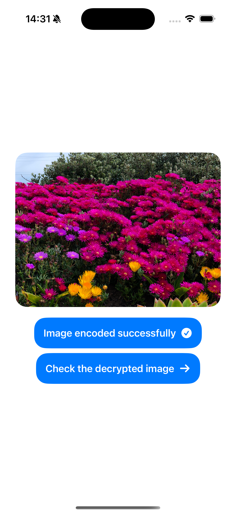
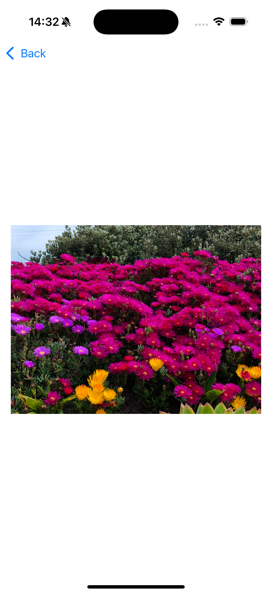

# PhotoEncry ptor

## Overview

**PhotoEncryptor** is an advanced and elegantly structured application designed to encrypt and decrypt photos efficiently. The project showcases a strong emphasis on clean architecture and adherence to software design principles such as SOLID, Object-Oriented Programming (OOP), and Model-View-ViewModel (MVVM). This ensures that the codebase is maintainable, scalable, and easy to extend, making it an exemplary project for modern software development practices.

This project highlights proficiency in both core programming concepts and software architecture, positioning it as a standout in any portfolio.

## Key Features

- **Photo Encryption/Decryption:** Securely encrypt and decrypt photos using industry-standard cryptographic methods.
- **Structured Codebase:** A clean, modular, and highly organized structure, promoting maintainability and scalability.
- **Adherence to SOLID Principles:** The design strictly follows SOLID principles, ensuring the system is robust and adaptable to change.
- **MVVM Architecture:** Employs the MVVM pattern, separating concerns between UI and business logic for better testability and flexibility.
- **OOP Implementation:** Thoughtful application of object-oriented programming concepts enhances code readability and reusability.
  
## Code Structure and Best Practices

### SOLID Principles

- **Single Responsibility Principle (SRP):** Each class in the project has a well-defined responsibility, ensuring that the code is easy to manage and extend. For example, encryption logic is isolated from the UI components, making both easier to test and maintain.
  
- **Open/Closed Principle (OCP):** The system is designed to be easily extensible. New functionality can be added without modifying existing code, preserving the stability of the application while allowing for growth.

- **Liskov Substitution Principle (LSP):** The application follows OOP best practices, ensuring that derived classes can replace their base classes without altering the correctness of the application.

- **Interface Segregation Principle (ISP):** Interfaces in the project are client-specific, ensuring that no class is forced to implement unnecessary methods.

- **Dependency Inversion Principle (DIP):** High-level modules are not dependent on low-level modules. Abstractions are used effectively to promote flexibility and reduce coupling.

### MVVM Architecture

The project leverages the **MVVM (Model-View-ViewModel)** architecture, ensuring a clear separation of concerns. This pattern makes the application more modular, testable, and easier to scale:

- **Model:** Handles the encryption logic and business rules.
- **ViewModel:** Acts as an intermediary between the Model and the View, containing all the necessary logic and state management for the UI without directly interacting with the user interface elements.
- **View:** A user interface that reflects changes in the ViewModel, promoting a reactive and dynamic user experience.

This approach ensures the application remains flexible and testable while maintaining a clean separation between the UI and business logic.

## Views

### 1. Main Interface
   The main view where users can select photos for encryption or decryption. This simple and intuitive UI focuses on user experience.
   
   
   

### 2. Encryption Status
   A visual representation of the encryption process and status.
   
   

### 3. Decryption Process
   A straightforward view that allows users to see decrypted photos, ensuring seamless and secure access to their files.
   
   

## Installation

1. Clone the repository:
   ```bash
   git clone https://github.com/queeeety/PhotoEncryptor.git
   ```

2. Navigate to the project directory:
   ```bash
   cd PhotoEncryptor
   ```

3. Build and run the project using your preferred development environment.

## License
This project is licensed under the MIT License.
You are not allowed to post this project on other websites or claim it as your own.